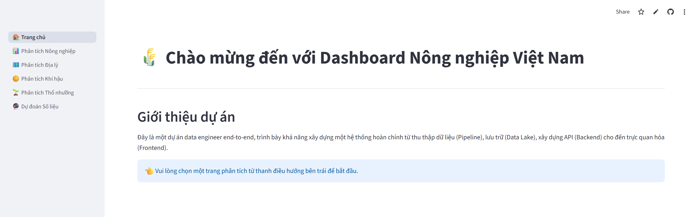

<div align="center">

# Vietnam Agriculture Analytics API & Dashboard



</div>

This repository contains the **application layer** for an end-to-end data engineering project. It consists of a decoupled FastAPI backend (API) and a Streamlit frontend (dashboard) to serve and visualize agricultural data for Vietnam.

The data itself is sourced, processed, and managed by a separate data pipeline project.

---

## 🔗 Related Projects

This application is the visualization layer of a complete end-to-end data engineering ecosystem. To understand how the data is collected and processed, check out the upstream repositories:

*   **[Vietnam Agriculture Data Lake](https://github.com/MinhHuy1507/vietnam-agriculture-datalake-public)**
    *   **Role:** Data Ingestion & Storage.
    *   **Function:** Collects raw data from General Statistics Office Of Viet Nam (GSO), NASA POWER, Google Earth Engine.

*   **[Vietnam Agriculture Data Warehouse](https://github.com/MinhHuy1507/vietnam-agriculture-data-warehouse-public)**
    *   **Role:** Data Transformation & Modeling.
    *   **Function:** Builds a Data Warehouse (Star Schema) from the Data Lake using Airflow and dbt for optimized analytics.


## 🚀 Live Demo

This application is deployed as two separate services:

* **Frontend (Streamlit Dashboard):**
    [vietnam-agri-app-public.streamlit.app](https://vietnam-agriculture-app-public.streamlit.app/)
* **Backend (FastAPI API Docs):**
    [FastAPI/docs](https://vietnam-agriculture-app-public-backend.onrender.com/docs)

---

## 🏛️ Architecture Overview

This project follows a decoupled, microservice-based architecture, containerized with Docker.

1.  **Backend (API Service):** A high-performance **FastAPI** application responsible for serving data from the PostgreSQL database via RESTful endpoints.
    * **➡️ [View Backend Details](./backend/README.md)**

2.  **Frontend (Dashboard Service):** A multi-page **Streamlit** application that acts as the presentation layer. It calls the Backend API to fetch data and renders interactive visualizations.
    * **➡️ [View Frontend Details](./frontend/README.md)**

3.  **Database (Data Service):** A **PostgreSQL** database (hosted on Render) that stores the cleaned data (agri, climate, soil) prepared by the data pipeline.


## 🛠️ Combined Technology Stack

| Category | Tool | Purpose |
| :--- | :--- | :--- |
| **Backend** |  | API server |
| |  | Database ORM & Pydantic Validation |
| **Frontend** |  | Interactive Dashboard UI |
| |  | 2D Interactive Charts |
| |  | 3D Geospatial Mapping |
| **Database** |  | Application Database |
| **Deployment** |  | Containerization & Local Dev |
| **Hosting** | **Render.com** | Hosting for PostgreSQL + Backend API |
| | **Streamlit Cloud** | Hosting for Frontend Dashboard |

## 📦 Running Locally (with Docker Compose)

This is the simplest way to run the entire application stack (Backend, Frontend, DB, and Seeder) on your local machine.

### Prerequisites
* [Docker Desktop](https://www.docker.com/products/docker-desktop/) installed and running.

### Steps
1.  **Clone the Repository:**
    ```bash
    git clone "https://github.com/MinhHuy1507/vietnam-agriculture-app-public"
    cd vietnam-agriculture-app-public
    ```

2.  **Sync Local Database (Optional but Recommended):**
    * The `docker-compose.yml` is configured to use the user/pass `vietnamagriculture`.
    * To allow `seed_db.py` to run from your local machine (outside Docker), open `backend/utils/connect_database.py` and ensure the `_DEFAULT` variables match your local setup *or* the Docker setup (if you want to seed the Docker DB from your local terminal).

3.  **Build and Run:**
    * This command will build the `backend` and `frontend` images, start the `app-db` container, and then run the `db-seeder` job to populate the database.
    ```bash
    docker-compose build .
    docker-compose up -d
    ```

4.  **Wait for Seeder (Important):**
    * The `db-seeder` service needs about 1-2 minutes to run `seed_db.py` and populate the database. You can monitor its progress:
    ```bash
    docker-compose logs -f db-seeder
    ```
    * Wait until you see `🎉 Quá trình nạp dữ liệu mồi hoàn tất!`.

5.  **Access the Application:**
    * **Frontend (Streamlit):** [http://localhost:8501](http://localhost:8501)
    * **Backend (FastAPI Docs):** [http://localhost:8000/docs](http://localhost:8000/docs)
    * **Database (Postgres):** `localhost:5433` (Connect with DBeaver/PgAdmin using user/pass from `docker-compose.yml`)

## 📄 License
This project is licensed under the **Mozilla Public License 2.0 (MPL 2.0)**. See the `LICENSE` file for details.