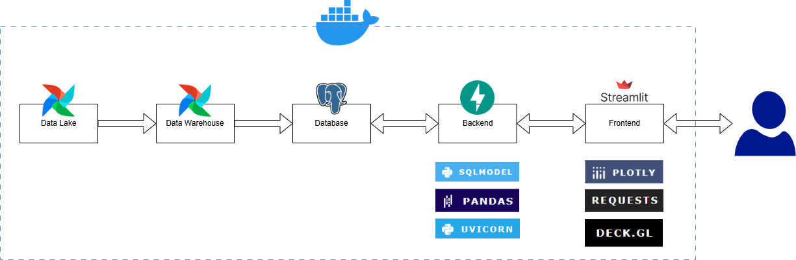

# Project Architecture: Vietnam Agriculture Analytics App

## 1. Overview of the Application Layer

This document describes the architectural design of the Vietnam Agriculture Analytics Application. It is the application layer that sits atop a pre-existing [Data Pipeline](https://github.com/MinhHuy1507/vietnam-agriculture-datalake) responsible for data ingestion and processing.

The core principle behind this architecture is **decoupling**, ensuring that the backend data service (API) and the frontend visualization (Dashboard) can operate and scale independently.

## 2. Architectural Diagram

Here's a high-level overview of the entire End-to-End architecture:

*Figure: Complete architecture showing data flow from pipeline to visualization*

## 3. Key Architectural Decisions & Components

### 3.1. Decoupled Backend and Frontend

* **Decision:** To build the backend (API) and frontend (Dashboard) as separate, independent services.
* **Rationale:**
    * **Scalability:** Each service can be scaled independently based on demand (e.g., if the dashboard gets more traffic than the API).
    * **Maintainability:** Changes to the frontend UI do not require redeploying the backend, and vice versa.
    * **Technology Flexibility:** Allows different technologies for UI and backend logic (e.g., Python for both, but could easily swap frontend to React/Vue).
    * **API Reusability:** The FastAPI backend can be consumed by other clients (mobile apps, other dashboards) in the future.

### 3.2. Backend: FastAPI (API Service)

* **Role:** Provides a secure and efficient interface for the frontend to retrieve processed data from the database. It encapsulates business logic for data retrieval and initial processing (e.g., joining tables).
* **Technologies:**
    * **FastAPI:** Chosen for its high performance, ease of use, automatic Pydantic validation, and built-in interactive API documentation (Swagger UI/OpenAPI).
    * **SQLModel:** Selected as the ORM (Object-Relational Mapper) to interact with the PostgreSQL database. It seamlessly integrates Pydantic models for both database schema definition and API request/response validation, reducing boilerplate code.
    * **Uvicorn:** The ASGI server to run the FastAPI application, ensuring asynchronous capabilities.
* **Deployment:** Hosted on **Render.com** as a Web Service. This allows continuous deployment from GitHub and provides a dedicated, always-on (albeit free-tier sleeping) server for the API.

### 3.3. Frontend: Streamlit (Dashboard Service)

* **Role:** The user-facing application that fetches data from the FastAPI backend and visualizes it in an interactive dashboard format.
* **Technologies:**
    * **Streamlit:** Chosen for rapid development of data applications with interactive widgets and straightforward deployment. Its Python-native approach speeds up the iterative design process.
    * **Plotly Express & Plotly Graph Objects:** Utilized for creating highly interactive and visually rich 2D charts (line, bar, treemap, scatter plots).
    * **PyDeck:** Integrated for powerful 3D geospatial visualizations, allowing for dynamic mapping of agricultural indicators across regions.
    * **Pandas:** Extensively used for in-memory data manipulation, filtering, and aggregation on the frontend for responsiveness.
* **Deployment:** Hosted on **Streamlit Community Cloud**. This platform offers free, seamless hosting for Streamlit applications directly from GitHub, handling environment setup and scaling.
* **Localization:** The dashboard UI is intentionally built in Vietnamese, as it is targeted towards a Vietnamese-speaking audience.

### 3.4. Database: PostgreSQL

* **Role:** The persistent storage layer for all cleaned and transformed agricultural, climate, and soil data. It is the single source of truth for the application.
* **Technology:** **PostgreSQL:** A robust, open-source relational database, chosen for its reliability, data integrity features, and strong support for analytical queries.
* **Deployment:** Hosted on **Render.com** as a Managed PostgreSQL Database. This provides a cloud-managed database instance, abstracting away infrastructure concerns.

## 4. Data Flow within the Application

1.  **Backend Initialization:** The FastAPI application starts and establishes a connection to the PostgreSQL database using environment variables (managed securely via Render's environment variables).
2.  **Frontend Initialization:** The Streamlit application starts and retrieves the `API_BASE_URL` from its secrets (managed securely via Streamlit Cloud's secrets).
3.  **Data Request (Frontend to Backend):** When a user navigates the dashboard or applies filters, the Streamlit frontend sends HTTP GET requests to the FastAPI backend's specific endpoints (e.g., `/api/v1/statistics/agriculture-data`).
4.  **Data Retrieval & Processing (Backend):**
    * The FastAPI endpoint receives the request and extracts any query parameters (e.g., `year`, `province_name`).
    * It uses SQLModel to construct and execute SQL queries (including `JOIN` operations) against the PostgreSQL database.
    * Data is retrieved from the database, often converted into Pydantic models (for validation), and then returned as JSON.
5.  **Data Caching (Frontend):** The Streamlit frontend uses `@st.cache_data` to cache API responses for a specified duration (e.g., 10 minutes). This significantly reduces redundant API calls and improves dashboard responsiveness.
6.  **Visualization (Frontend):** The cached (or newly fetched) data is then used by Plotly and PyDeck to render interactive charts and maps on the Streamlit dashboard.

## 5. Local Development Environment

* **Docker & Docker Compose:** A `docker-compose.yml` file in the root repository defines all services (backend, frontend, database, seeder) and their interconnections. This enables a consistent and isolated development environment that mirrors the production setup, allowing developers to run the entire stack with a single command.
* **VS Code Dev Containers / GitHub Codespaces:** A `.devcontainer` configuration is provided to set up a standardized development environment, including necessary extensions and dependencies, directly within a container. This streamlines onboarding and ensures all developers work in a consistent setup.

---
**[Return to Main Project README](../README.md)**